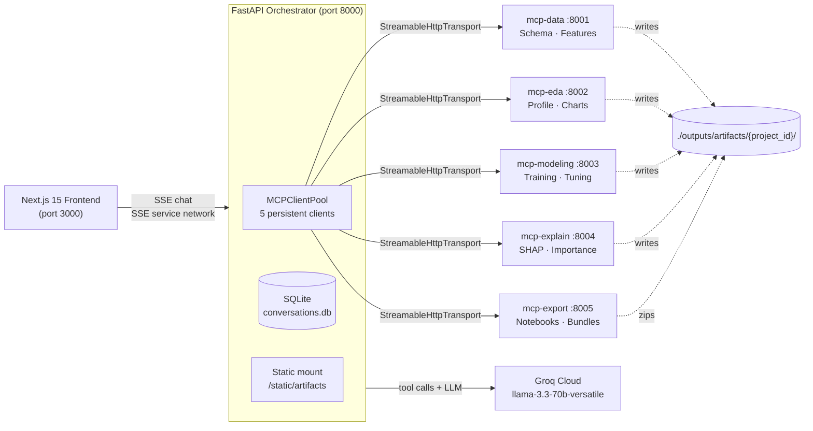

<div align="center">

# NSK AI Labs — BharatPro AutoML

**AI-native AutoML platform powered by five MCP microservices.**

Ask in plain English. Get real notebooks, models, and reports.

*NSK AI Labs · MetaOptics + AI Research*

</div>

---

BharatPro AutoML by NSK AI Labs is an enterprise-grade AutoML platform that orchestrates five specialized [Model Context Protocol](https://modelcontextprotocol.io) microservices behind a single conversational interface. Upload a CSV, describe your goal in natural language, and the platform plans, executes, and packages a full data science pipeline — exploratory analysis, feature engineering, model training, explainability, and downloadable artifact bundles — without you ever writing code.

The interface is built for students, analysts, and ML engineers who want production-quality output with chat-first ergonomics. The architecture is built for teams who want to extend, swap, or scale any pipeline stage independently.

**Stack:** Python 3.11 · FastAPI · FastMCP 3 · Groq (Llama 3.3 70B) · Next.js 15 · React 19 · Tailwind 3.4 · Supabase

**Support:** <admin@nskailabs.com> · [nskailabs.com](https://sites.google.com/nskailabs.com/nskailabs/home)

---

## Table of Contents

1. [Why BharatPro AutoML](#why-bharatpro-automl)
2. [Architecture](#architecture)
3. [Microservice Catalog](#microservice-catalog)
4. [The Artifact Pipeline](#the-artifact-pipeline)
5. [Activity Timeline UX](#activity-timeline-ux)
6. [Quick Start](#quick-start)
7. [Project Structure](#project-structure)
8. [Configuration](#configuration)
9. [HTTP API Reference](#http-api-reference)
10. [Development](#development)
11. [Roadmap](#roadmap)
12. [License & Support](#license--support)

---

## Why BharatPro AutoML

Most AutoML tools force a tradeoff: either a low-code GUI that hides the engineering, or a notebook-first SDK that reproduces nothing. BharatPro AutoML sits between them — the conversation produces *real, runnable, downloadable artifacts* on every step. Every chart is a PNG. Every model is a pickled scikit-learn pipeline. Every analysis is a Jupyter notebook you can re-execute locally.

What makes the platform different:

- **Distributed by design.** Each pipeline stage is an independent FastMCP server. If `mcp-modeling` crashes mid-training, the rest of the system keeps responding and the UI lights up red until you fix it. No monolith means no single point of failure.
- **Conversational, not procedural.** You don't choose algorithms or set hyperparameters — you describe the outcome. The orchestrator picks tools, routes calls across services, and surfaces a clean activity timeline (no raw tool names) so the experience feels like Claude or Cursor, not a debugger.
- **Real artifacts, every time.** No fake links, no placeholders. Every notebook is generated with `nbformat`, rendered to HTML with `nbconvert`, and bundled into a downloadable ZIP at the end of the run.
- **Native MCP prompts.** Type `/` in the composer to invoke multi-step prompt templates (`/eda-deep-dive`, `/explain-champion`) defined directly inside MCP servers — a feature no other AutoML tool currently exposes.

---

## Architecture



**Request lifecycle:**

1. The user sends a chat message. The browser streams it to `POST /api/chat` (Server-Sent Events).
2. The orchestrator assembles a unified tool catalog from all five services via the `MCPClientPool` and forwards it to Groq with the user's query.
3. Groq decides which tool(s) to invoke. The orchestrator routes each call to its owning microservice over `streamable-http`, captures progress events, and persists results.
4. Tools write their artifacts to a per-conversation directory under `outputs/artifacts/{project_id}/`.
5. The frontend receives a stream of `activity_start` / `activity_progress` / `activity_end` events and renders them as a human-readable timeline, plus `artifact_manifest` events that hydrate the workspace pane on the right.

---

## Microservice Catalog

| Service | Port | Tools (selected) | Resources | Prompts |
|---|---|---|---|---|
| `mcp-data` | 8001 | `list_uploaded_files` · `ingest_dataset` · `validate_schema_with_pandera` · `run_feature_engineering` | `dataset://{name}/schema` | — |
| `mcp-eda` | 8002 | `run_full_eda` · `render_correlation_matrix` | — | `/eda-deep-dive` |
| `mcp-modeling` | 8003 | `run_full_training` · `run_parallel_bake_off` · `trigger_hyperparameter_sweep` | — | — |
| `mcp-explain` | 8004 | `calculate_shap_values` · `generate_feature_importance_plot` | `model://{id}/explainability-card` | — |
| `mcp-export` | 8005 | `generate_jupyter_notebook` · `compile_pdf_report` · `bundle_project_export` | — | — |

Each service runs `mcp.run(transport="streamable-http", host="127.0.0.1", port=N)` and is independently reloadable. The orchestrator's background refresher reconnects offline services every 15 seconds with no manual intervention.

---

## The Artifact Pipeline

BharatPro AutoML produces a **complete, downloadable data science project** in four sequential stages. Each stage writes real files to disk under `outputs/artifacts/{project_id}/<stage>/` — no placeholders, no fake links.

### Stage 1 — Exploratory Data Analysis (`mcp-eda`)

Triggered by phrases like *"Give a full EDA"* or `/eda-deep-dive`. Produces:

```
EDA/
├── report_eda.ipynb          # runnable Jupyter notebook
├── report_eda.html           # nbconvert-rendered, standalone
├── report_eda.md             # markdown summary with recommendations
├── eda_summary.json          # machine-readable metadata
├── correlation.png           # heatmap of numeric correlations
├── distributions.png         # histogram grid for numeric columns
├── missing_values.png        # per-column missing bar chart
└── pairplots.png             # seaborn pairplot (top features)
```

The notebook covers missing values, distributions, skewness, outliers (IQR), pairwise correlations, target analysis (if specified), and actionable next-step recommendations.

### Stage 2 — Feature Engineering (`mcp-data`)

Triggered by *"Prepare the data for modeling"* or after EDA recommends transformations. Produces:

```
FeatureEngineering/
├── feature_engineering.ipynb     # reproducible pipeline
├── refined_dataset.csv           # transformed dataset, ready for training
├── feature_engineering_report.md # before/after shape, transformations applied
└── feature_metadata.json         # per-column metadata (dtype, scaler, encoder)
```

Applied transformations: median/mode imputation, one-hot or label encoding (cardinality-aware), `StandardScaler` for numerics, IQR-based outlier clipping, mutual-information feature selection, date-field extraction, and optional polynomial / interaction features.

### Stage 3 — Training Pipeline (`mcp-modeling`)

Triggered by *"Train a model"* or *"Run the bake-off"*. Produces:

```
Training/
├── training_pipeline.ipynb     # end-to-end reproducible pipeline
├── training_report.html        # nbconvert-rendered report
├── trained_model.pkl           # joblib-pickled scikit-learn pipeline
├── metrics.json                # accuracy/F1/ROC-AUC or RMSE/R²
├── predictions.csv             # test-set predictions + ground truth
├── confusion_matrix.png        # classification only
├── feature_importance.png      # tree-based or permutation
└── cross_validation.json       # per-fold scores
```

Trains Random Forest, XGBoost, LightGBM, and a linear baseline in parallel; selects the best by CV; optionally runs a short Optuna TPE sweep on the champion. All seeds fixed for reproducibility.

### Stage 4 — Export Bundle (`mcp-export`)

Triggered by *"Package everything"* or *"Give me the export"*. Calls `bundle_project_export` which walks the project directory, zips every artifact, and returns a clickable download card.

```
project_export.zip
├── EDA/
├── FeatureEngineering/
├── Training/
├── Artifacts/      # mixed/shared outputs
└── Models/         # copy of trained_model.pkl with metadata.json
```

The workspace pane displays the bundle as a single card with the directory tree, total size, and individual file downloads.

---

## Activity Timeline UX

Earlier versions of the platform exposed raw MCP tool names in the chat thread (`#1 generate_jupyter_notebook`, `#2 run_parallel_bake_off`). This was useful for debugging but felt like an internal dashboard. The current UX hides these by default and surfaces a **conversational activity timeline** instead:

```
●  Loading dataset
   ✓  iris.csv — 150 rows × 5 columns

●  Running exploratory analysis
   ↳ Computing missing values…
   ↳ Building correlation matrix…
   ↳ Rendering distributions…
   ✓  EDA bundle ready (8 artifacts)

●  Engineering features
   ✓  refined_dataset.csv — 150 rows × 12 columns

●  Training models
   ↳ Random Forest…   cv_mean=0.967
   ↳ XGBoost…         cv_mean=0.973   ← champion
   ↳ LightGBM…        cv_mean=0.960
   ✓  Champion saved

●  Packaging project export
   ✓  project_export.zip — 1.4 MB
```

Each activity has a friendly label drawn from a tool-name mapping (`run_full_eda` → "Running exploratory analysis"), a category icon, progress sub-steps streamed via MCP `Context.report_progress`, a duration badge, and a status indicator. Errors surface inline with a retry affordance and a toast notification.

For users who want to inspect the raw tool calls — arguments, results, durations, owning service — toggle **Developer Mode** in the settings menu (or press `⌘ + Shift + D`). The original tool-call cards reappear underneath each activity in a collapsed accordion.

---

## Quick Start

### Prerequisites

- **Python 3.11+** with `pip` and `venv`
- **Node.js 20+** with `npm`
- **A Groq API key** — sign up at [console.groq.com](https://console.groq.com)

### One-time setup

```bash
# Clone
git clone <your-repo-url> bharatpro-automl && cd bharatpro-automl

# Backend: create venv and install
cd backend
python3 -m venv .venv && source .venv/bin/activate
pip install -r requirements.txt -r requirements-additions.txt

# Configure the API key
cat > .env <<EOF
GROQ_API_KEY=gsk_your_key_here
GROQ_MODEL=llama-3.3-70b-versatile
CORS_ORIGINS=http://localhost:3000
EOF

# Frontend: install
cd ../frontend
npm install
```

### Run everything

```bash
# Terminal 1 — boot 5 microservices + orchestrator
./scripts/start_all.sh

# Terminal 2 — frontend dev server
cd frontend && npm run dev
```

Open <http://localhost:3000>. Wait for the **MCP Network** sidebar to show **5/5 online**, then upload a CSV and ask the copilot to *"give a full EDA and train a model"*.

---

## Project Structure

```
bharatpro-automl/
├── scripts/
│   └── start_all.sh                 # boots all 6 processes (5 MCP + 1 FastAPI)
├── backend/
│   ├── mcp_data.py                  # microservice :8001
│   ├── mcp_eda.py                   # microservice :8002
│   ├── mcp_modeling.py              # microservice :8003
│   ├── mcp_explain.py               # microservice :8004
│   ├── mcp_export.py                # microservice :8005
│   ├── main.py                      # FastAPI orchestrator :8000
│   ├── core/
│   │   ├── config.py                # pydantic settings
│   │   ├── mcp_pool.py              # multi-client connection pool
│   │   ├── orchestrator.py          # SSE Groq ↔ MCP loop
│   │   ├── artifacts.py             # shared artifact-writer utility
│   │   ├── events.py                # tool-name → activity-label mapping
│   │   └── logger.py
│   ├── schemas/
│   │   └── chat.py                  # pydantic request/response models
│   ├── database.py                  # SQLAlchemy models
│   ├── outputs/
│   │   └── artifacts/
│   │       └── {project_id}/        # one folder per conversation
│   │           ├── EDA/
│   │           ├── FeatureEngineering/
│   │           ├── Training/
│   │           ├── Artifacts/
│   │           ├── Models/
│   │           └── project_export.zip
│   ├── uploads/                     # user-uploaded CSVs
│   ├── requirements.txt
│   └── requirements-additions.txt   # nbformat, nbconvert, pandera, reportlab
├── frontend/
│   ├── app/
│   │   ├── layout.tsx
│   │   ├── page.tsx
│   │   └── globals.css
│   ├── components/
│   │   ├── ChatInterface.tsx        # 3-column split layout
│   │   ├── ConversationSidebar.tsx
│   │   ├── ServiceStatusPanel.tsx
│   │   ├── ActivityTimeline.tsx     # the conversational status feed
│   │   ├── ArtifactBundleCard.tsx   # downloadable bundle viewer
│   │   ├── ArtifactViewer.tsx       # right-pane tabbed workspace
│   │   ├── DatasetSidebar.tsx
│   │   ├── ChatComposer.tsx         # textarea + slash-prompt menu
│   │   ├── PromptCommandMenu.tsx
│   │   ├── MessageBubble.tsx
│   │   ├── ToastHost.tsx            # transient notifications
│   │   ├── HelpDialog.tsx
│   │   └── EmptyState.tsx
│   ├── hooks/
│   │   ├── useStreamingChat.ts      # SSE chat consumer
│   │   ├── useServiceNetwork.ts     # SSE service-status consumer
│   │   └── useToasts.ts
│   ├── lib/
│   │   ├── api.ts                   # typed fetch wrappers
│   │   ├── streamingClient.ts       # SSE parser
│   │   ├── activity.ts              # friendly-label map
│   │   └── types.ts
│   ├── tailwind.config.ts           # dark canvas palette
│   ├── package.json
│   └── tsconfig.json
├── logs/                            # per-service stdout/stderr (gitignored)
└── README.md
```

---

## Configuration

All configuration is environment-driven and loaded from `backend/.env`. Defaults work for local development.

| Variable | Default | Description |
|---|---|---|
| `GROQ_API_KEY` | *(required)* | Groq Cloud API key |
| `GROQ_MODEL` | `llama-3.3-70b-versatile` | LLM used for tool routing |
| `UPLOAD_DIR` | `./uploads` | Where uploaded CSVs land |
| `OUTPUT_DIR` | `./outputs` | Root for all generated artifacts |
| `MAX_TOOL_ITERATIONS` | `8` | Max round-trips per chat turn |
| `MAX_UPLOAD_MB` | `200` | Per-file upload ceiling |
| `CORS_ORIGINS` | `http://localhost:3000` | Comma-separated allowlist |
| `MCP_DATA_URL` | `http://127.0.0.1:8001/mcp` | Override to point at a remote service |
| `MCP_EDA_URL` | `http://127.0.0.1:8002/mcp` | … |
| `MCP_MODELING_URL` | `http://127.0.0.1:8003/mcp` | … |
| `MCP_EXPLAIN_URL` | `http://127.0.0.1:8004/mcp` | … |
| `MCP_EXPORT_URL` | `http://127.0.0.1:8005/mcp` | … |

The frontend reads `NEXT_PUBLIC_API_BASE_URL` (defaults to `http://localhost:8000`) — set this if the orchestrator runs on a different host.

---

## HTTP API Reference

The FastAPI orchestrator exposes the following endpoints. Everything is documented interactively at <http://localhost:8000/docs>.

### Chat & conversations

| Method | Path | Purpose |
|---|---|---|
| `POST` | `/api/chat` | Streaming chat completion (SSE). Body: `{query, active_file, conversation_id, history, prompt_name, prompt_arguments}`. |
| `GET`  | `/api/conversations` | List recent conversations. |
| `GET`  | `/api/conversations/{id}/messages` | Replay a conversation. |
| `DELETE` | `/api/conversations/{id}` | Delete a conversation and its artifacts. |

### Files & artifacts

| Method | Path | Purpose |
|---|---|---|
| `POST` | `/api/upload` | Upload a CSV/TSV (multipart). |
| `GET`  | `/api/datasets` | List uploaded files. |
| `GET`  | `/api/artifacts/{project_id}` | Manifest of every artifact for a conversation. |
| `GET`  | `/api/bundle/{project_id}` | Trigger ZIP packaging and download `project_export.zip`. |
| `GET`  | `/api/download/{filename}` | Direct download for any file under `outputs/`. |
| `GET`  | `/static/artifacts/{project_id}/{stage}/{file}` | Direct static access (charts, HTML reports). |

### Service network

| Method | Path | Purpose |
|---|---|---|
| `GET`  | `/api/health` | Orchestrator liveness + Groq configured? |
| `GET`  | `/api/services` | Snapshot: 5 microservices, tool counts, prompt counts. |
| `POST` | `/api/services/refresh` | Force a reconnect cycle. |
| `GET`  | `/api/services/stream` | SSE stream of `service_status` events. |
| `GET`  | `/api/prompts` | All native MCP prompt templates (drives the slash menu). |

### SSE event protocol

Every `/api/chat` response is a stream of JSON-encoded events:

| Event type | Fields | Meaning |
|---|---|---|
| `meta` | `conversation_id`, `title`, `prompt_name` | Sent first, before any tokens. |
| `token` | `content` | Incremental assistant text. |
| `activity_start` | `task_id`, `label`, `category`, `tool`, `service` | A pipeline step began. |
| `activity_progress` | `task_id`, `message`, `percentage` | Sub-step update from `ctx.report_progress`. |
| `activity_end` | `task_id`, `status`, `duration_ms`, `artifact_manifest` | Step finished; manifest lists files written. |
| `service_status` | `service: {name, status, last_error}` | A microservice changed state. |
| `done` | `answer`, `tool_calls` | Final assembled response. |
| `error` | `message` | Fatal error. |

---

## Development

```bash
# Run a single microservice with hot reload (e.g. iterating on EDA)
cd backend && source .venv/bin/activate
python mcp_eda.py

# Restart the pool's connection to that service from the UI:
#   click the MCP Network panel's refresh icon, or hit:
curl -X POST http://localhost:8000/api/services/refresh

# Frontend type-check + lint
cd frontend && npm run typecheck && npm run lint

# Tail all microservice logs
tail -f logs/*.log
```

### Adding a new tool to an existing service

```python
# In mcp_eda.py
@mcp.tool
async def my_new_analysis(file_path: str, ctx: Context) -> dict:
    """One-line description shown to the LLM."""
    await ctx.report_progress(50, 100, "Crunching numbers")
    # ... do work, write artifacts via core.artifacts.ArtifactBundle ...
    return {"status": "ok", "artifacts": [...]}
```

Restart the microservice. The orchestrator's pool will pick up the new tool on the next refresh cycle (≤15 s) and Groq will see it in the unified catalog immediately. No frontend changes needed unless you want a custom activity label — add one entry to `backend/core/events.py` and `frontend/lib/activity.ts`.

### Adding a new microservice

1. Copy `mcp_eda.py` as a template, change the port and `SERVICE_NAME`.
2. Register the URL in `backend/core/config.py` under `microservice_map`.
3. Add a row to `scripts/start_all.sh`.
4. Add a label and color to `frontend/components/ServiceStatusPanel.tsx`.

The pool auto-discovers tools/resources/prompts on connection.

---

## Roadmap

**Shipped**
- ✅ Distributed 5-microservice architecture over `streamable-http`
- ✅ Multi-client connection pool with per-service health tracking
- ✅ Live service-network SSE panel
- ✅ Native MCP prompts surfaced via `/` slash menu
- ✅ Dark-themed Linear/Vercel-inspired UI
- ✅ Workspace pane with auto-extracted artifacts (charts, reports, tables, files)
- ✅ Conversation persistence in SQLite

**In progress**
- 🔄 Complete 4-stage artifact pipeline (EDA → Features → Training → Export Bundle) with real `.ipynb` + `nbconvert` HTML output
- 🔄 Conversational activity timeline replacing raw tool-call cards
- 🔄 Developer Mode toggle (`⌘ + Shift + D`) to reveal underlying MCP calls
- 🔄 Toast notification system for completions and errors with retry

**Planned**
- ⏳ Multi-tenant project isolation
- ⏳ Resumable training jobs with checkpointing
- ⏳ Time-series forecasting microservice (`mcp-timeseries` :8006)
- ⏳ Vector store retrieval over uploaded documents
- ⏳ One-click deploy to Modal / Fly.io
- ⏳ Authentication and per-user artifact scoping

---

## License & Support

Internal use only — license terms TBD.

For questions, bug reports, or partnership inquiries, reach NSK AI Labs at <admin@nskailabs.com> or visit [nskailabs.com](https://sites.google.com/nskailabs.com/nskailabs/home). We typically reply within one business day.

---

<div align="center">
<sub>Built with care for students, analysts, and engineers who want production output from a conversation.</sub>
</div>